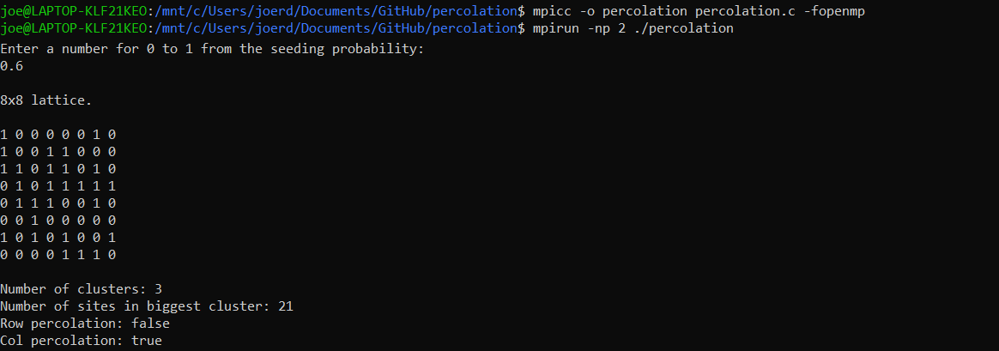
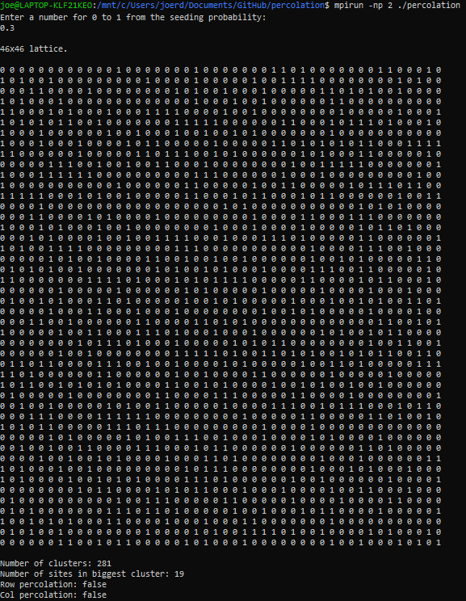

# lattice-percolation
Lattice percolation in C using MPI and OpenMP for parallel computing. Percolation generally refers to when liquids filter through solid materials, such as water through coffee grounds. Percolation can also describe systems where nearest-neighbor interactions are important, such as the magnetic interaction between atoms in iron, or where bonds can be formed spontaneously, such as cross linking between polymers, leading to gels.

This application focuses on an abstract version of this concept. A square NxN lattice is created consisting of N^2 sites. Each site can either be empty or filled. Clusters are defined as a collection of a filled neighbour sites, where sites to the north, east, south, and west of a site are neighbour sites. This application randomly fills a lattice, finds each cluster using depth first search and then computes whether row and/or column percolation occurs. Row/column percolation is when a cluster occupies a site in every row/column. E.g. row percolation would be the equivalent to water being poured into a lattice at the top, and following a path to the bottom. Column percolation is similar.

## Introduction
This application is written in C. It uses MPI and OpenMP that provide parallel computing functionalities.

### What is MPI?
The MPI Standard is a message passing library standard. The goal of MPI is to provide a portable, efficient and flexible standard for message passing parallel programming.

### What is OpenMP?
OpenMP (Open Multi-Processing) is an API that supports multi-platform shared-memory multiprocessing programming in C.

### Why are we using both?
MPI and OpenMP provide different functionalities. An application can be designed with a hybrid model of parallel programming in mind. This allows us to run the program on a computer cluster using both OpenMP and MPI. OpenMP is used for parallelism within a (multi-core) node, while MPI is used for parallelism between nodes. In other words, we use MPI to run multiple separate processes, and send and receive information between those processes. We then use OpenMP to run multiple threads per process, and share information between those threads.

## Requirements
I will assume you are using Linux. If you are using Windows 10 you can also download the [Linux Subsystem for Windows](https://docs.microsoft.com/en-us/windows/wsl/install-win10) which is very useful.

### MPI
To use MPI with C, you must include mpi.h as a header. It can be included in your C program with `#include <mpi.h>`, you may need to directly reference its absolute path such as `#include "/usr/include/mpi/mpi.h"`.

### OpenMP
To use OpenMP, you must include omp.h as a header. It can be included in your C program with `#include <omp.h>`, you may need to directly reference its absolute path as well.

## How to run
To compile the C file correctly, you should compile it with mpicc.

You can install this on linux by `sudo apt install openmpi-bin` and `sudo apt install libopenmpi-dev`.

1. Download `percolation.c`.
2. Enter `mpicc -o percolation percolation.c -fopenmp` to compile `percolation.c.`.
3. Enter `mpirun -np 2 ./percolation` to execute the application.

This runs the application with two processes, that each have 2 threads. The constants in the program can be changed at your risk to modify how many threads per process and processes are used.

## Scenarios

### Scenario 1
A scenario with a 8x8 lattice with column percolation but not row percolation. The biggest cluster has 21 sites and performs the column percolation, there are 3 total clusters. Note that clusters do not have a boundary and wrap around to the other side of the lattice.

### Scenario 2
A scenario with a 46x46 lattice where there is no row or column percolation. The seeding probability used was 0.3. The biggest cluster has 281 sites, and there are 19 clusters in total.

## Implementation
Multiple processes are spawned when the program is executed. The first process requests input from the user for the seeding probability of the lattice to be generated. It then sends this probability to all other processes and each process calls the function `percolate(double prob, int world_rank)`. The first process generates the lattice, and computes how to split it between the processes, it sends the lattice and the respective split information to each process.

Each process receives the lattice and which segment of the lattice it is responsible for. OpenMP parallel codeblocks are then used, and each process is split into multiple threads. The segment that a process is responsible for is further divided and each division is assigned to a thread, this is managed by using `#pragma omp parallel` and `#pragma omp for schedule` which gives chunks of the for loop to each thread to perform.

The for loop goes through the respective segment of the lattice and performs depth first search to find the clusters within the segment. `#pragma omp critical` is used when it is important that only one thread performs a section of code at a time, such as adding to the list of clusters that is shared between all threads. At the end the `#pragma omp critical` codeblock is used again to merge the clusters found by one thread with clusters found by another thread. Each thread only searched up to its boundaries, and therefore we look along the border of each segment, and merge the clusters into one cluster if there are adjacent sites.

Finally, we compute the number of clusters, the size of the cluster with the most sites, and whether row and/or column percolation occurs.

## More information
Princeton University has a [good introduction to MPI and OpenMP for C](https://princetonuniversity.github.io/PUbootcamp/sessions/parallel-programming/Intro_PP_bootcamp_2018.pdf). Visit [openmp.org](https://www.openmp.org/) for more information on OpenMP, and [open-mpi.org](https://www.open-mpi.org/) for more information on MPI. The wikipedia pages for [MPI](https://en.wikipedia.org/wiki/Open_MPI) and [OpenMP](https://en.wikipedia.org/wiki/OpenMP) are useful. A good description of percolation can be found [here](http://web.mit.edu/8.334/www/grades/projects/projects14/PeterFedak/percolate.html).
